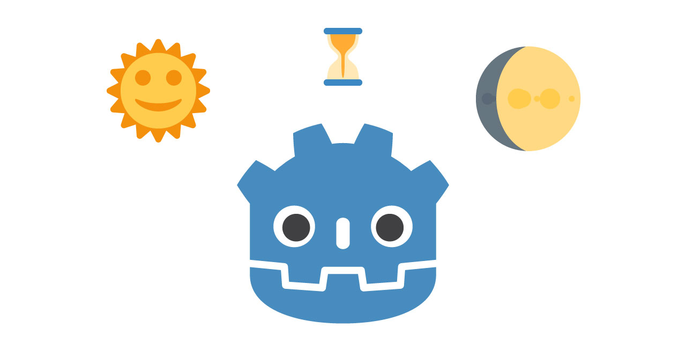

# Godot 3 2D Day/Night Cycle

  [](https://github.com/hiulit/Godot-3-2D-Day-Night-Cycle/blob/master/LICENSE)

A 2D ☀️ Day / 🌔 Night cycle using `CanvasModulate` and a moon light effect using `Light2D`.



## Examples


*Cycle without the moon light.*


*Cycle with the moon light.*


*Cycle with the moon light moving.*
## Installation

- [Download](https://github.com/hiulit/Godot-3-2D-Day-Night-Cycle/archive/master.zip) the repository ZIP file.
- Copy the **Time** singleton in your project and [enable](https://docs.godotengine.org/en/stable/getting_started/step_by_step/singletons_autoload.html) it.
    - `src/singletons/Time.gd`
- Copy the **Day/Night Cycle** folder in your project.
    - `src/day_night_cycle`
- Copy **Moon** folder in your project.
    - `src/moon`
- Copy the **Debug overlay** folder in your project.
    - `src/debug_overlay`
## Usage


### Tips

Instance one `DayNightCycle.tscn` in your background scene and another `DayNightCycle.tscn` in your main scene or level scene, etc. and set the **Day start hour** in the background scene a little after than the **Day start hour** in the main scene to have the effect that the background starts changing before the foreground.

```
Main
├── Background
│   └── DayNightCycle
├── Player
├── OtherStuff
└── DayNightCycle
```

#### Example

* Background scene - **Day start hour**: 10.2
* Main scene - **Day start hour**: 10

... XXX ...

## 📑 Documentation

- [Day/Night Cycle](docs/DAY_NIGHT_CYCLE.md)
- [Moon](docs/MOON.md)
- [Time](docs/TIME.md)

## 🗒️ Changelog

See [CHANGELOG](/CHANGELOG.md).

## 👤 Author

**hiulit**

- Twitter: [@hiulit](https://twitter.com/hiulit)
- GitHub: [@hiulit](https://github.com/kefhiulitranabg)

## 🤝 Contributing

Feel free to:

- [Open an issue](https://github.com/hiulit/RetroPie-Godot-Game-Engine-Emulator/issues) if you find a bug.
- [Create a pull request](https://github.com/hiulit/RetroPie-Godot-Game-Engine-Emulator/pulls) if you have a new cool feature to add to the project.
- [Start a new discussion]() about a feature request.

## 🙌 Supporting this project

If this project helped you, please consider supporting it through any size donations ❤️.

[](https://www.patreon.com/hiulit)

[](https://ko-fi.com/F2F7136ND)

[](https://www.paypal.com/paypalme/hiulit)

Or just drop a star ⭐️.


## 👏 Credits

Thanks to:

- **Solo CodeNet** for the [YouTube video tutorial](https://www.youtube.com/watch?v=sz8fyzvB6q0) that inspired me.
- [Terkwood](https://github.com/Terkwood) - For helping with an issue about comparison operators in the cycle state.
- [Twemoji](https://twemoji.twitter.com/) - For the emojis.
- **Andrea Calabró** - For creating the Godot logo.


## 📝 Licenses

- Source code: [MIT License](/LICENSE).
- Emojis: [CC BY 4.0](https://creativecommons.org/licenses/by/4.0/)
- Godot logo: [CC BY 3.0](https://creativecommons.org/licenses/by/3.0/).


