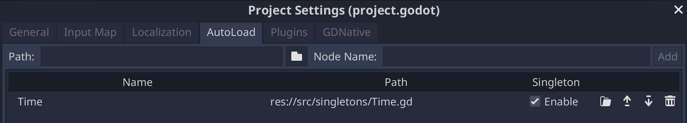
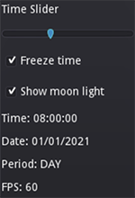

# Godot 3 2D Day/Night Cycle

  

A 2D ☀️ Day / 🌔 Night cycle using `CanvasModulate` and a moon light effect using `Light2D`.


## Examples


*Cycle without the moon light.*


*Cycle with the moon light static.*


*Cycle with the moon light moving.*

## 🕹️ Demo

- Clone the repository or [download](https://github.com/hiulit/Godot-3-2D-Day-Night-Cycle/archive/master.zip) it in a ZIP file.
- Open `day_night_cycle/project.godot`.
- Play around 🙂.

## 📑 Documentation

- [Time](docs/time.md)
- [DayNightCycle](docs/day_night_cycle.md)
- [MoonLight](docs/moon_light.md)
- [DebugOverlay](docs/debug_overlay.md)

## 🛠️ Setup

- Clone the repository or [download](https://github.com/hiulit/Godot-3-2D-Day-Night-Cycle/archive/master.zip) it in a ZIP file.
- Copy the following files and folders to your project:
    - `time.gd` file (`day_night_cycle/src/singletons/time.gd`).
    - `day_night_cycle` folder (`day_night_cycle/src/day_night_cycle`).
    - `moon_light` folder (`day_night_cycle/src/moon_light`).
    - `debug_overlay` folder (`day_night_cycle/src/debug_overlay`).

## 🚀 Usage

- [Prerequisites](#prerequisites)
- [Add a simple cycle](#add-a-simple-cycle)
- [Add a cycle with a moon light](#add-a-cycle-with-a-moon-light)
- [Add a delay between cycles](#add-a-delay-between-cycles)
- [Add a debug overlay](#add-a-debug-overlay)

### Prerequisites

Add the `Time` singleton:

- Go to `Project` -> `Project Settings`.
- Go to the `AutoLoad` tab.
- Add the `time.gd` file.
- Enable it.



Change the `Time` [parameters](docs/time.md) to your liking.

### Add a simple cycle

Instance the `DayNightCycle` node in the root scene.

```
Node
├── TileMap
├── Player
├── OtherStuff
└── DayNightCycle
```

Change the `DayNightCycle` [parameters](docs/day_night_cycle.md) to your liking.

### Add a cycle with a moon light

Instance the `DayNightCycle` node and the `MoonLight` node in the root scene.

```
Node
├── TileMap
├── Player
├── OtherStuff
├── DayNightCycle
└── MoonLight
```

[Sync](docs/moon_light.md#cycle_sync_node_path) the `MoonLight` with the `DayNightCycle`.

The `MoonLight` can be [static](docs/moon_light.md#static_moon) or [moving](docs/moon_light.md#move_moon) in sync with a `DayNightCycle`.

Change the `DayNightCycle` [parameters](docs/DAY_NIGHT_CYCLE.md) and the `MoonLight` [parameters](docs/moon_light.md) to your liking.

### Add a delay between cycles

- Create a `CanvasLayer` for the background and set its `layer` to `-1`.
- Instance the `DayNightCycle` node in the background `CanvasLayer` previously created.
- Instance another `DayNightCycle` node in the root scene and add a [delay](docs/DAY_NIGHT_CYCLE.md#delay).
- Instance the `MoonLight` in the root scene and [sync it](docs/moon_light.md#cycle_sync_node_path) to the `DayNightCycle` node with a delay.

Something like this:

```
Node
├── CanvasLayer (layer = -1)
│   └── BackgroundSprite
│   └── DayNightCycleBackground (delay = 0)
├── TileMap
├── Player
├── OtherStuff
└── DayNightCycleForeground (delay = 1800)
└── MoonLight (cycle_sync_node_path = DayNightCycleForeground)
```

This will create the effect that the background starts changing before the foreground.

### Add a debug overlay

Test the passing of time, the cycles and the moon light.



- Create a `CanvasLayer` and set its `layer` to `1`.
- Instance the `DebugOverlay` node.

Something like this:

```
Node
├── TileMap
├── Player
├── OtherStuff
├── DayNightCycle
├── MoonLight
└── CanvasLayer (layer = 1)
    └── DebugOverlay
```

## 🗒️ Changelog

See [CHANGELOG](/CHANGELOG.md).

## 👤 Author

- hiulit

## 🤝 Contributing

Feel free to:

- [Open an issue](https://github.com/hiulit/Godot-3-2D-Day-Night-Cycle/issues) if you find a bug.
- [Create a pull request](https://github.com/hiulit/Godot-3-2D-Day-Night-Cycle/pulls) if you have a new cool feature to add to the project.

## 🙌 Supporting this project

If you find this project helpful, please consider supporting it through any size donations to help make it better ❤️.

[](https://www.patreon.com/hiulit)

[](https://ko-fi.com/F2F7136ND)

[](https://www.buymeacoffee.com/hiulit)

[](https://www.paypal.com/paypalme/hiulit)

If you can't, consider sharing it with the world...

[](https://twitter.com/intent/tweet?url=https%3A%2F%2Fgithub.com%2Fhiulit%2FGodot-3-2D-Day-Night-Cycle&text=%22Godot+3+2D+Day%2FNight+Cycle%22%0D%0AA+2D+%E2%98%80%EF%B8%8F+Day+%2F+%F0%9F%8C%94+Night+cycle+using+CanvasModulate+and+a+moon+light+effect+using+Light2D+by+%40hiulit)

... or giving it a [star ⭐️](https://github.com/hiulit/Godot-3-2D-Day-Night-Cycle/stargazers).

## 👏 Credits

Thanks to:

- [Solo CodeNet](https://twitter.com/codenetsolo) - For the [YouTube video tutorial](https://www.youtube.com/watch?v=sz8fyzvB6q0) that inspired this project.
- [Terkwood](https://github.com/Terkwood) - For helping with an issue about comparison operators in the cycle state.
- [Mitch Curtis](https://github.com/mitchcurtis) - For an amazing PR ([#4](https://github.com/hiulit/Godot-3-2D-Day-Night-Cycle/pull/4)) that helped improve the project big time.
- [Luis Zuno](https://twitter.com/ansimuz) - For creating the [Sunny Land](https://opengameart.org/content/sunny-land-2d-pixel-art-pack) assets.
- [Twemoji](https://twemoji.twitter.com/) - For the emojis.
- **Andrea Calabró** - For creating the Godot logo.

## 📝 Licenses

- Source code: [MIT License](/LICENSE).
- Emojis: [CC BY 4.0](https://creativecommons.org/licenses/by/4.0/)
- Godot logo: [CC BY 3.0](https://creativecommons.org/licenses/by/3.0/).
- Sunny Land assets: [Public domain](https://creativecommons.org/publicdomain/zero/1.0/deed).
