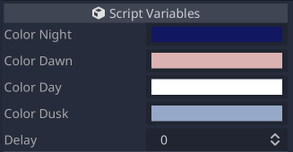

# DayNightCycle

## Parameters

### Color Night

| Name | Type | Description | Default |
| - | - | - | - |
| `color_night` | `Color` | The color of the night state. | `Color(0.07, 0.09, 0.38, 1.0)` |

### Color Dawn

| Name | Type | Description | Default |
| - | - | - | - |
| `color_dawn` | `Color` | The color of the dawn state. | `Color(0.86, 0.70, 0.70, 1.0)` |

### Color Day

| Name | Type | Description | Default |
| - | - | - | - |
| `color_day` | `Color` | The color of the day state. | `Color(1.0, 1.0, 1.0, 1.0)` |

### Color Dusk

| Name | Type | Description | Default |
| - | - | - | - |
| `color_dusk` | `Color` | The color of the dusk state. | `Color(0.59, 0.66, 0.78, 1.0)` |

### Delay

| Name | Type | Description | Default |
| - | - | - | - |
| `delay` | `int` | The amount of in-game seconds of delay. | `0` |
