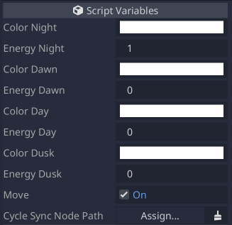

# Moon

## Parameters

### Color Night

| Name | Type | Description |
| - | - | - |
| `color_night` | `Color` | The color of the night state. |

### Energy Night

| Name | Type | Description |
| --- | --- | --- |
| `energy_night` | `float` | The energy value of the night state. The larger the value, the stronger the light. |

### Color Dawn

| Name | Type | Description |
| - | - | - |
| `color_dawn` | `Color` | The color of the dawn state. |

### Energy Dawn

| Name | Type | Description |
| --- | --- | --- |
| `energy_dawn` | `float` | The energy value of the dawn state. The larger the value, the stronger the light. |

### Color Day

| Name | Type | Description |
| - | - | - |
| `color_day` | `Color` | The color of the day state. |

### Energy Day

| Name | Type | Description |
| --- | --- | --- |
| `energy_day` | `float` | The energy value of the day state. The larger the value, the stronger the light. |

### Color Dusk

| Name | Type | Description |
| - | - | - |
| `color_dusk` | `Color` | The color of the dusk state. |

### Energy Dusk

| Name | Type | Description |
| --- | --- | --- |
| `energy_dusk` | `float` | The energy value of the dusk state. The larger the value, the stronger the light. |

### Move

| Name | Type | Description |
| --- | --- | --- |
| `move` | `bool` | Enables/disables the moon movement. |

### Cycle Sync Node Path

| Name | Type | Description |
| --- | --- | --- |
| `cycle_sync_node_path` | `NodePath` | The `day_night_cycle` node which the moon will sync with. The moon will only show if there is a `day_night_cycle` node assigned. |
