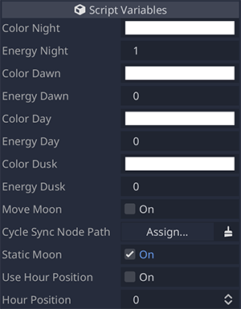
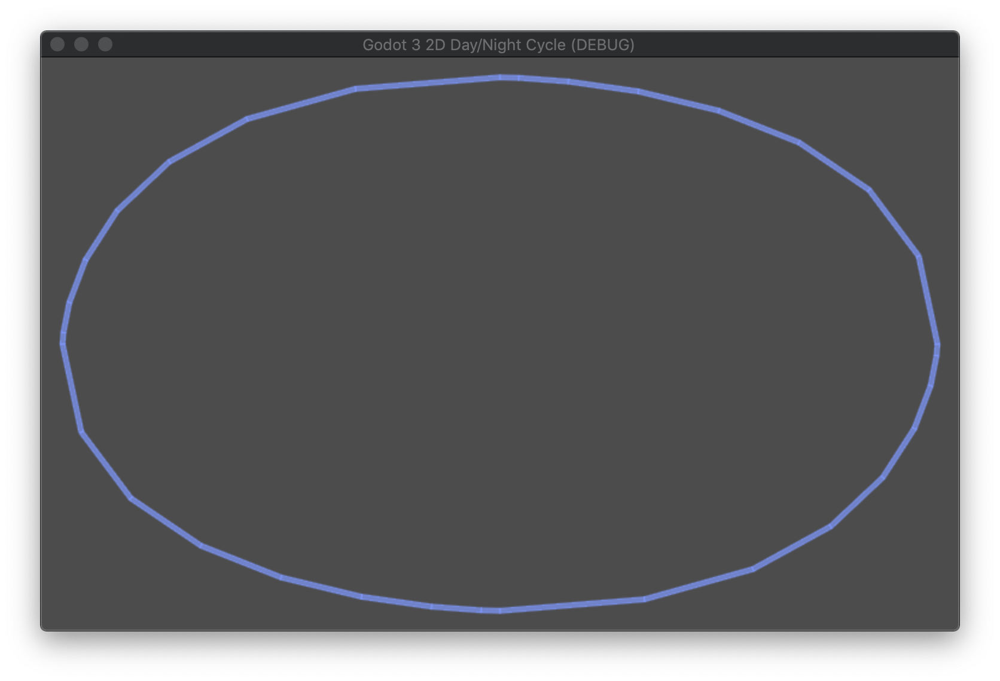

# MoonLight

## Parameters

### Color Night

| Name | Type | Description | Default |
| - | - | - | - |
| `color_night` | `Color` | The color of the night state. | `Color(1.0, 1.0, 1.0, 1.0)` |

### Energy Night

| Name | Type | Description | Default |
| - | - | - | - |
| `energy_night` | `float` | The energy value of the night state. The larger the value, the stronger the light. | `1.0` |

### Color Dawn

| Name | Type | Description | Default |
| - | - | - | - |
| `color_dawn` | `Color` | The color of the dawn state. | `Color(1.0, 1.0, 1.0, 1.0)` |

### Energy Dawn

| Name | Type | Description | Default |
| - | - | - | - |
| `energy_dawn` | `float` | The energy value of the dawn state. The larger the value, the stronger the light. | `0.0` |

### Color Day

| Name | Type | Description | Default |
| - | - | - | - |
| `color_day` | `Color` | The color of the day state. | `Color(1.0, 1.0, 1.0, 1.0)` |

### Energy Day

| Name | Type | Description | Default |
| - | - | - | - |
| `energy_day` | `float` | The energy value of the day state. The larger the value, the stronger the light. | `0.0` |

### Color Dusk

| Name | Type | Description | Default |
| - | - | - | - |
| `color_dusk` | `Color` | The color of the dusk state. | `Color(1.0, 1.0, 1.0, 1.0)` |

### Energy Dusk

| Name | Type | Description | Default |
| - | - | - | - |
| `energy_dusk` | `float` | The energy value of the dusk state. The larger the value, the stronger the light. | `0.0` |

### Move Moon

| Name | Type | Description | Default |
| - | - | - | - |
| `move_moon` | `bool` | Enables the `MoonLight` node movement. | `false` |

### Cycle Sync Node Path

| Name | Type | Description | Default |
| - | - | - | - |
| `cycle_sync_node_path` | `NodePath` | The `DayNightCycle` node which the moon will sync with. The `MoonLight` node will only show if there is a `DayNightCycle` node assigned to it. | `none` |

### Static moon

| Name | Type | Description | Default |
| - | - | - | - |
| `static_moon` | `bool` | Disables the `MoonLight` node movement. | `true` |

### Use hour position

| Name | Type | Description | Default |
| - | - | - | - |
| `use_hour_position` | `bool` | If enabled, the position of the `MoonLight` node is determined by `hour_position`. If not enabled, the position of the `MoonLight` node is determined by its `position`. It only works when `static_moon` is enabled. | `false` |

### Hour position

| Name | Type | Description | Default |
| - | - | - | - |
| `hour_position` | `int` | The hour of the day, in a 24-hour clock, to position the `MoonLight` node (0-23). | `0` |

## Path

The moon light path is a [Curve2D](https://docs.godotengine.org/en/stable/classes/class_curve2d.html).

The default path is like the one in the following image.

A new path can be set by changing the `Curve2D` in `path`.
